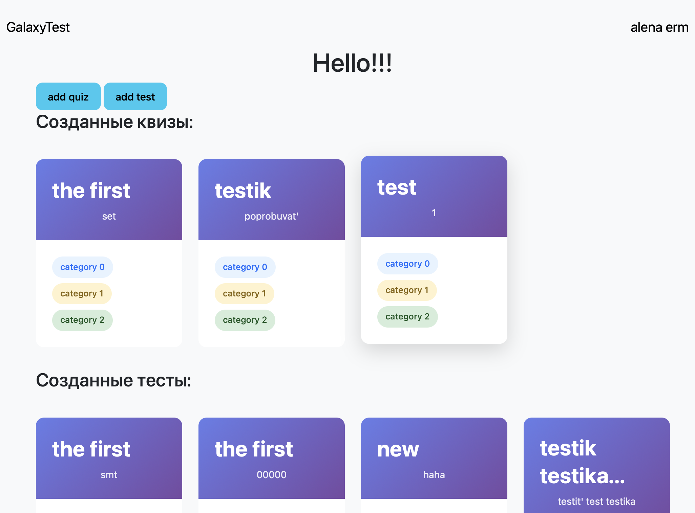

# GalaxyTest

Платформа для создания квизов и карточек для запоминания.

Регистрация уникального пользователя по почте.
Для всех доступны начальные тесты по астрономии с использование бесплатных.
Поиск картинки по дате рождения/ежедевное обновление главной картинке на странице входа с помощью API Nasa (APOD).

Каждый пользователь может создавать свои квизы по нужным темам с помощью формы, проходить их и просматривать их как
конспект.

Также у пользователя есть возможность создавать карточки для запоминания, группируя несколько тем в один блок. После
чего может пройти тест
на их знание или пройти просмотр всех карточек 1 темы.

Структура базы данных: https://www.figma.com/board/vQAFtUXvc23XkXBNWMajjW/GalaxyTest?node-id=0-1&t=8xmNrDtw31wnLn0N-1

# Пояснительная записка проекта GalaxyTest

Автор: Ермакович Алёна

Идея проекта: Платформа для создания квизов и карточек запоминания с регистрацией по электронной почте, где главная страница ежедневно обновляется изображениями через NASA APOD API. Зарегистрированные пользователи могут создавать собственные квизы по любым темам, проходить их и просматривать как конспект, а также формировать карточки для запоминания и последующего тестирования или повторения материала.

Используемые технологии: Flask, Alembic, Flask-login, Flask-wtf, Jinja2, Sqlalchemy, Sqlalchemy-serializer, wtforms

Реализация: 
База данных строится от сущности пользователя. 
Сущность квиза имеет отношение к пользователю, вопрос имеет отношение к квизу, ответ имеет отношение к вопросу - все модели имеют отношение один ко многим.
Сущность теста имеет отношение к пользователю, карточка имеет отношение к тесту - также все отношения один ко многим.
Сущности теста и квиза имеют отношения многие ко многим с таблицей категорий.

Путь пользователя: главная -> регистрация -> вход -> главная -> создание квиза/теста
Создание квиза: информация о квизе -> ревью структуры квиза -> добавление вопроса -> ревью структуры вопросы -> добавление ответа -> ревью вопроса + возможность редактирования -> сохранение квиза -> главная -> возможность редактировать/играть
Создание теста: аналогично с квизом

Презинтация: https://www.figma.com/deck/4c1jllNwsmgotETQbwpmFp